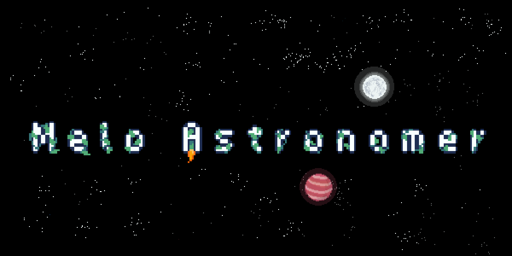

# Melo Astronomer

  

A melancholic spaced themed farming game.

Checkout the [Design Doc](https://docs.google.com/document/d/1xq8jR8LlegB-B6DlreXa6K_KRdj1nVW3QA7ovoa350k/edit?usp=sharing "") for more details

## Pixel Art
This game uses two different color palettes, one for day and night. The art is 16x16. Feel free
to shift the saturation and brightness as needed. Black and white always allowed

- `Daytime` [.ase](repo/ma_day.ase)

- `Nighttime` [.ase](repo/ma_night.ase)

## Building and running
This project uses [Gradle](http://gradle.org/) to manage dependencies.

To get started, open the root build.gradle as a project in your favorite IDE. (_hint: IntelliJ IDEA_)
To run the desktop build just run the Gradle task `lwjgl3:run`

You can also use these Gradle tasks to build and run various parts of the code:
- `lwjgl3:run` - Run the desktop app
- `lwjgl3:dist` - Build the desktop app into a JAR. It can be found at `lwjgl3/build/libs`.
- `lwjgl3:clean build jpackageImage` - Bundles the JRE along with the desktop app into the current OS' app format

Other useful Gradle tasks and flags:
- `--continue`: when using this flag, errors will not stop the tasks from running.
- `--daemon`: thanks to this flag, Gradle daemon will be used to run chosen tasks.
- `--offline`: when using this flag, cached dependency archives will be used.
- `--refresh-dependencies`: this flag forces validation of all dependencies. Useful for snapshot versions.
- `build`: builds sources and archives of every project.
- `cleanEclipse`: removes Eclipse project data.
- `cleanIdea`: removes IntelliJ project data.
- `clean`: removes `build` folders, which store compiled classes and built archives.
- `eclipse`: generates Eclipse project data.
- `idea`: generates IntelliJ project data.
- `test`: runs unit tests (if any).

Note that most tasks that are not specific to a single project can be run with `name:` prefix, where the `name` should be replaced with the ID of a specific project.
For example, `core:clean` removes `build` folder only from the `core` project.

Looking to contribute? Checkout [Dev Wiki](DevWiki.MD) to get started
